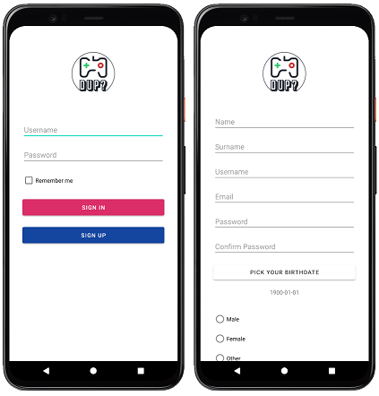
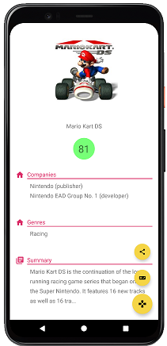
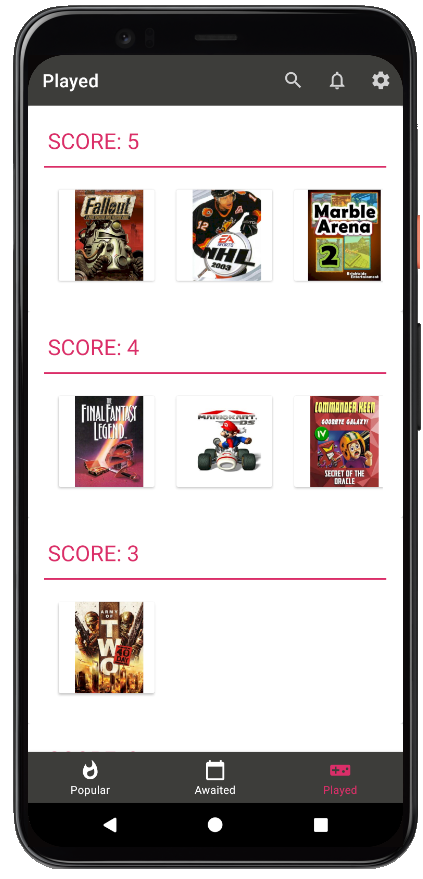
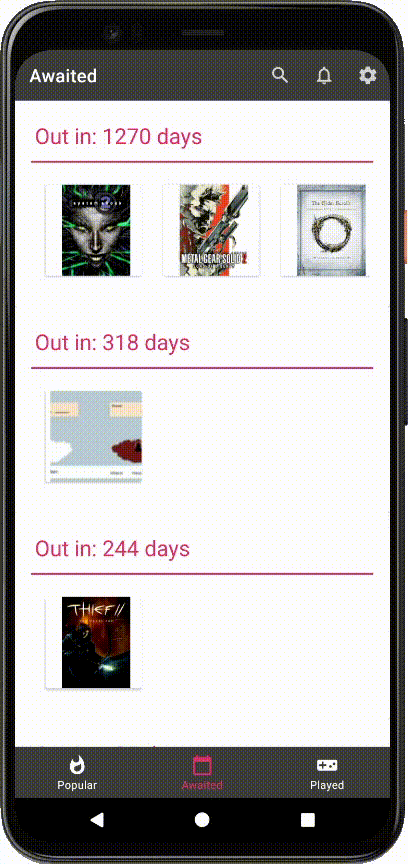

  
  <h1 align="center"> Did you play? </h1> 
  <h3 align="center"> School project for the <b><i>Android development using Java</i></b> course.</h3>

   

## An application for Videogamers
Have you played with all the games in your list? Are you waiting for a new videogame and you absolutely don't want to miss it on day one? Did you play a game but you don't remember its name?   
_**Did you play?**_ helps you solve all the classic problems that plague the average gamer!

## Goals
- Quickly searching for information on video games
- Discovering new titles to play based on recommendations from other users
- Being notified when a game you have been waiting for is released on the market
- Store all the tried games by grouping them according to a personal rating.
- Share interesting titles with other users

## Register
All you need is a username and password to have all your preferences at your fingertips. Recommend video games to other registered users and get recommendations on the next title to **nerd out on at night**! Each user will be associated with lists of expected and played video games.   
   

## Discover new videogames
Everything you need to know about a video game at your fingertips! For each title the following will be shown: **average rating, developer companies, genres, release date, plot and summary**.   
   
  

## Best advice
The _**Popular section**__ will show the list of the most played games among the users registered on the application.   
   

## Remember your favourite titles
Write down the titles you have played and give them a score from 1 to 5. You can review them all in the _**Played section**_.   
   

## Keep an eye on new releases
Add the games you are waiting for to the _**Awaited list**_, check release dates and receive day one notifications.   
   

 

## Share with your friends
Did you find an interesting game and you want to share it with your friends? Open the videogame page and send it to all your friends!     
 

 

## Repository content
Source code is composed by:
- **Android Client** developed in Java
- **Server Tomcat** developed in Java
- **Database** written in MySQL

## Notes
Due to the requirements needed for taking the exam, I had to simplify some processes:
- The project uses only _**Basic-Authentication**_ and the requests don't need authorization
- Currently, the database contains information about video games extracted using **APIs from _[igdb.com]("https://www.igdb.com")_**. Altough it would have been easier and faster, I wasn't allowed to call the API directly. 

## Future improvements
- [ ] Implement [MVVM]("https://developer.android.com/jetpack/guide") pattern; #1
- [ ] Remove information about video games from DB and use igdb's API to acquire them (using IDs); #2
- [ ] Implements safer **authentication and authorization** protocols. #3